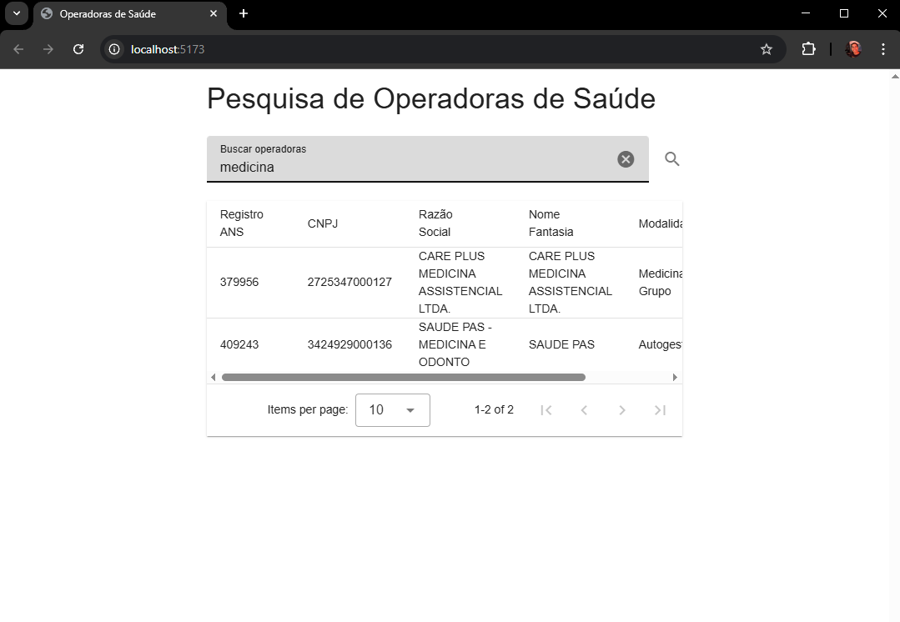

# 🚀 Sistema de Processamento de Dados ANS

Sistema para coleta, processamento e análise de dados da ANS, utilizando técnicas de Web Scraping, transformação de dados e APIs para disponibilização das informações.

## 📑 Visão Geral

Este projeto consiste em quatro implementações principais, cada uma focando em diferentes aspectos do processamento de dados:

1. **Web Scraping**: Coleta automatizada de documentos da ANS
2. **Transformação de Dados**: Processamento e estruturação dos dados coletados
3. **Operações de Banco de Dados**: Armazenamento e análise de dados das operadoras de saúde
4. **API & Interface**: Interface web para visualização e busca de dados

## 🛠️ Stack Tecnológica

- **Backend**:
    - Python 3.x
    - FastAPI
    - BeautifulSoup4
    - Pandas
    - MySQL
    - PyPDF2
    - pdfplumber
- **Frontend**:
    - Vue.js 3
    - Axios
    - Vite

## 🌳 Estrutura do Projeto

```
project/
├── backend/
│   ├── database/
│   │   ├── create_tables.sql
│   │   └── import_and_analyze.sql
│   ├── api.py
│   ├── check_csv.py
│   ├── compressor.py
│   ├── config.py
│   ├── data_transformer.py
│   ├── downloader.py
│   ├── ftp_downloader.py
│   ├── main.py
│   ├── requirements.txt
│   ├── run_api.py
│   └── scraper.py
├── frontend/
│   ├── src/
│   ├── index.html
│   ├── package-lock.json
│   ├── package.json
│   └── vite.config.js
├── images/
│   └── operadoras_search.png
├── .gitignore
├── README.md
├── main.py
└── postman_collection.json

```

### Backend

- **main.py**: Ponto de entrada principal que orquestra o processo de coleta de dados
- **api.py**: Implementação da API FastAPI para busca de operadoras
- **run_api.py**: Script para iniciar o servidor API
- **config.py**: Configurações e variáveis de ambiente
- **scraper.py**: Classe para web scraping do site da ANS
- **downloader.py**: Classe para download de arquivos PDF
- **ftp_downloader.py**: Classe para download de arquivos via FTP
- **data_transformer.py**: Processamento e transformação dos dados baixados
- **compressor.py**: Compressão de arquivos
- **database/**: Scripts SQL para operações de banco de dados
  - **create_tables.sql**: Criação do esquema do banco de dados
  - **import_and_analyze.sql**: Queries de importação e análise de dados

### Frontend

- **src/App.vue**: Componente principal da aplicação Vue
- **src/main.js**: Ponto de entrada do frontend, configuração do Vue e Vuetify
- **index.html**: Página HTML principal
- **vite.config.js**: Configuração do Vite (bundler)

### Diretórios de Dados

- **pdfs/**: Armazena os PDFs baixados
- **financial_data/**: Armazena os dados financeiros baixados
- **operators_data/**: Armazena os dados de operadoras baixados

## Fluxo de Funcionamento

1. O script `main.py` inicia o processo de coleta de dados:
   - Faz scraping do site da ANS para obter links de PDFs
   - Baixa os PDFs relevantes
   - Baixa dados financeiros via FTP
   - Baixa dados de operadoras ativas via FTP

2. Os dados são processados e transformados para o formato adequado

3. A API FastAPI disponibiliza endpoints para consulta dos dados

4. O frontend Vue.js consome a API e apresenta uma interface amigável para busca de operadoras

## 🚀 Começando

### Pré-requisitos

- Python 3.x
- Node.js & npm
- MySQL

### Instalação

1. **Clone o repositório**
    
    ```bash
    git clone git@github.com:jonasluis/intuitive-care.git
    cd intuitive-care
    
    ```
    
2. **Configure o ambiente Python**
    
    ```bash
    cd backend
    python -m venv venv
    
    # Windows
    .\\venv\\Scripts\\activate
    
    # Linux/macOS
    source venv/bin/activate
    
    ```
    
3. **Instale as dependências Python**
    
    Método 1 - Usando requirements.txt:
    
    ```bash
    pip install -r requirements.txt
    
    ```
    
    Método 2 - Instalação manual (caso o requirements.txt não funcione):
    
    ```bash
    # Instale as bibliotecas principais
    pip install --only-binary :all: beautifulsoup4 charset-normalizer python-dotenv requests pandas  tabula-py openpyxl PyPDF2
    
    # Instale as dependências da API
    pip install pdfplumber fastapi uvicorn
    
    
    # Instale o conector MySQL
    pip install mysql-connector-python
    
    ```
    
4. **Configure as variáveis de ambiente**
Crie um arquivo `.env` com:
    
    ```
    BASE_URL="[ANS_URL]"
    OPERATORS_DATA_URL="[OPERATORS_URL]"
    FINANCIAL_DATA_URL="[FINANCIAL_DATA_URL]"
    
    ``` 

## 💻 Executando o Projeto

### Coleta de Dados Backend

Você pode executar diferentes partes do processo de coleta de dados individualmente ou todas de uma vez:

1. **Apenas Web Scraping**
    
    ```bash
    python main.py scrape
    
    ```
    
    Isso irá coletar PDFs do site da ANS. e compactar em um .zip
    
2. **Apenas Web Scraping**
    
    ```bash
    python main.py transformar_dados
    
    ```
    
    Isso irá coletar PDFs do site da ANS. e compactar em um .zip
3. **Apenas Download de Dados Financeiros**
    
    ```bash
    python main.py download-financial
    
    ```
    
    Isso extrair dados da tabelas rol e eventos do pdf anexo 1 e compactar o csv gerado em um  Teste_Jonas_luis.zip.
    
4. **Apenas Download de Dados das Operadoras**
    
    ```bash
    python main.py download-operators
    
    ```
    
    Isso irá baixar dados das operadoras ativas.
    
5. **Executar Toda a Coleta de Dados**
    
    ```bash
    python main.py all
    
    ```
    
    Isso irá executar todas as etapas acima em sequência.
    

### Servidor API

Inicie o servidor API com:

```bash
python backend/run_api.py

```

A API estará disponível em `http://127.0.0.1:8000`

### Frontend

```bash
cd frontend
npm install
npm run dev

```

Acesse a interface em `http://localhost:5173`

## 🔍 Funcionalidades

### 1. Web Scraping (Branch: teste-01)

- Coleta automatizada de PDFs do site da ANS
- Identificação inteligente de documentos
- Sistema robusto de download com mecanismo de retry
- Verificação de integridade de arquivos
- Compressão automatizada

### 2. Transformação de Dados (Branch: teste-02)

- Extração de dados de PDFs
- Reconhecimento de estrutura de tabelas
- Limpeza e normalização de dados
- Conversão para CSV
- Compressão automatizada

### 3. Operações de Banco de Dados (Branch: teste-03)

- Armazenamento de dados financeiros
- Gerenciamento de informações das operadoras de saúde
- Queries de análise de desempenho
- Análise de tendências de mercado
- Avaliações de conformidade

### 4. API & Interface (Branch: teste-04)

- Endpoints RESTful
- Busca em tempo real de operadoras
- Visualização de dados
- Interface amigável
- Otimização de respostas

## 📊 Análise de Banco de Dados

O sistema fornece queries analíticas para:

- Top 10 operadoras por despesas (trimestral)
- Top 10 operadoras por despesas (anual)
- Análise de participação de mercado
- Avaliação de tendências financeiras

## 📱 Screenshots



## 🔌 API

A documentação completa da API está disponível na coleção do Postman incluída no projeto (`postman_collection.json`).

## 👨‍💻 Autor

**Jonas Luis**

- 📱 Telefone: 21 964655190
- 💼 LinkedIn: [linkedin.com/in/jonasluisds/](https://linkedin.com/in/jonasluisds/)
- 📧 Email: [jonasluis66@gmail.com](mailto:jonasluis66@gmail.com)


